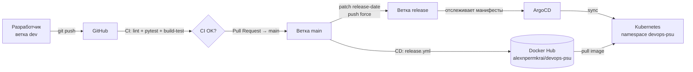
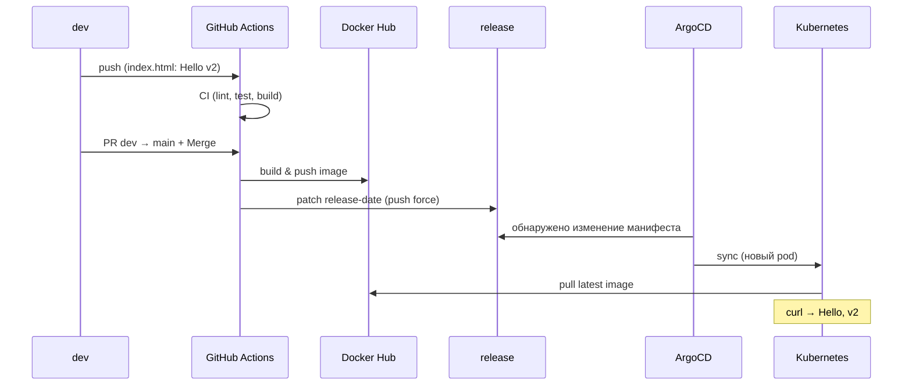

# ЛР 9. Cloud-native приложение и CI/CD-пайплайн

Учебный проект по курсу **DevOps (СИТУ)**.

Демонстрирует полный путь Cloud-native приложения:
**код → unit-тесты → Docker → CI (GitHub Actions) → Kubernetes-манифесты → CD (push в Docker Hub) → ArgoCD (GitOps) → кластер.**

- **GitHub:** https://github.com/alex-n-permkrai/lr9-devops-situ
- **Docker Hub:** https://hub.docker.com/r/alexnpermkrai/devops-psu
- **Стенд:** Ubuntu Server 24.04 (`10.0.0.100`), Docker, minikube, kubectl, ArgoCD

---

## Оглавление
1. [Архитектура и workflow](#1-архитектура-и-workflow)
2. [Структура репозитория](#2-структура-репозитория)
3. [Стратегия веток](#3-стратегия-веток)
4. [Приложение](#4-приложение-пункт-1)
5. [Unit-тесты](#5-unit-тесты-пункт-2)
6. [Докеризация](#6-докеризация-пункт-3)
7. [CI: lint / unit-test / build-test](#7-ci-lint--unit-test--build-test-пункт-4)
8. [Kubernetes-манифесты](#8-kubernetes-манифесты-пункт-5)
9. [CD: build & push в Docker Hub](#9-cd-build--push-в-docker-hub-пункт-6)
10. [ArgoCD (GitOps)](#10-argocd-gitops-пункт-7)
11. [Проверка всего пайплайна в сборе](#11-проверка-всего-пайплайна-в-сборе-пункт-8)
12. [Локальный запуск и отладка](#12-локальный-запуск-и-отладка)
13. [Итоги](#13-итоги)

---

## 1. Архитектура и workflow



Логика веток:
- **dev** — разработка, сюда пушат наработки; запускается CI.
- **main** — проверенный код; при merge запускается CD (сборка и публикация образа).
- **release** — служебная ветка с «золотым» манифестом (в неё пайплайн дописывает `release-date`); её отслеживает ArgoCD.

---

## 2. Структура репозитория

```
lr9-devops-situ/
├── README.md
├── requirements.txt              # зависимости для линтера и тестов
├── .gitignore
├── server/
│   ├── application.py            # HTTP-приложение
│   ├── test_application.py       # unit-тесты (pytest)
│   ├── dockerfile                # сборка образа
│   └── index.html                # отдаваемая страница (Hello, vN)
├── server-k8s-manifests/
│   └── devops-psu.yml            # Namespace + Deployment + Service (LoadBalancer)
├── argocd/
│   └── application.yml           # ArgoCD Application (декларативно)
└── .github/
    └── workflows/
        ├── cicd.yml              # CI: lint → unit-tests → build-test
        └── release.yml           # CD: docker build & push + patch манифеста
```

---

## 3. Стратегия веток

Ветка `main` защищена: прямые пуши запрещены, изменения — только через Pull Request.

> **Скриншот 1.** Настройки защиты ветки `main` (Settings → Branches / Rulesets, `Require a pull request before merging`).

```bash
git switch -c dev          # разработка
# ...работаем, коммитим...
git push origin dev        # → запускается CI
# на GitHub: Pull Request dev → main → Merge → запускается CD
```

---

## 4. Приложение (пункт 1)

Простой HTTP-сервер на стандартной библиотеке Python (`http.server` + `socketserver`), слушает порт **8000**.
Содержит класс `TestMe`, который используется в unit-тестах.

`server/application.py`:
```python
"""Small HTTP server application."""

import http.server
import socketserver

PORT = 8000


class ReusableTCPServer(socketserver.TCPServer):
    """TCP server with reusable address."""
    allow_reuse_address = True


class TestMe:
    """Class used by unit tests."""

    @staticmethod
    def take_five():
        """Return five."""
        return 5

    @staticmethod
    def port():
        """Return application port."""
        return PORT


def main():
    """Start HTTP server."""
    handler = http.server.SimpleHTTPRequestHandler
    with ReusableTCPServer(("", PORT), handler) as httpd:
        print(f"serving at port {PORT}")
        httpd.serve_forever()


if __name__ == "__main__":
    main()
```

> **Примечание:** в исходном шаблоне метода `take_five()` возвращалось `4`, из-за чего unit-тест падал. Исправлено на `5`, чтобы тесты проходили.

---

## 5. Unit-тесты (пункт 2)

`server/test_application.py`:
```python
"""Unit tests for application."""

from application import TestMe


def test_server():
    assert TestMe().take_five() == 5


def test_port():
    assert TestMe().port() == 8000
```

Запуск локально:
```bash
pytest
```

> **Скриншот 2.** Успешный прогон `pytest` (`2 passed`).

---

## 6. Докеризация (пункт 3)

`server/dockerfile`:
```dockerfile
FROM python:3.12-slim

RUN useradd --create-home --shell /bin/bash runner \
    && mkdir -p /usr/local/http-server

WORKDIR /usr/local/http-server
COPY application.py index.html ./
RUN chown -R runner:runner /usr/local/http-server

EXPOSE 8000
USER runner
CMD ["python3", "-u", "/usr/local/http-server/application.py"]
```

Локальная сборка и проверка:
```bash
docker build -t test-image ./server --file ./server/dockerfile
docker run -d --name app-server8000 -p 8000:8000 test-image
curl http://127.0.0.1:8000     # -> Hello, v1
docker rm -f app-server8000
```

> **Скриншот 3.** Успешный `docker build`, `docker run` и ответ `curl` → `Hello, v1`.

---

## 7. CI: lint / unit-test / build-test (пункт 4)

`.github/workflows/cicd.yml` запускается на `push` в `dev` и на PR в `main`.
Три задачи: **lint (pylint) → unit-tests (pytest) → build-test (docker build + run + curl)**.
`build-test` стартует только после успешных `lint` и `unit-tests` (`needs`).

```yaml
name: LINT-TEST-BUILD-CHECK
on:
  push:
    branches: [ dev ]
  pull_request:
    branches: [ main ]

jobs:
  lint:
    runs-on: ubuntu-24.04
    steps:
      - uses: actions/checkout@v4
      - uses: actions/setup-python@v5
        with: { python-version: '3.12' }
      - run: |
          pip install -r requirements.txt
          pylint server/application.py

  unit-tests:
    runs-on: ubuntu-24.04
    steps:
      - uses: actions/checkout@v4
      - uses: actions/setup-python@v5
        with: { python-version: '3.12' }
      - run: |
          pip install -r requirements.txt
          pytest --junitxml=junit/test-results.xml

  build-test:
    needs: [ lint, unit-tests ]
    runs-on: ubuntu-24.04
    steps:
      - uses: actions/checkout@v4
      - run: docker build -t test-image ./server --file ./server/dockerfile
      - run: docker run -d --name app-server8000 -p 8000:8000 test-image
      - run: docker ps -a
      - run: |
          sleep 5
          curl --fail http://127.0.0.1:8000
```

> **Скриншот 4.** GitHub → Actions → успешный workflow `LINT-TEST-BUILD-CHECK` (все 3 job зелёные).

---

## 8. Kubernetes-манифесты (пункт 5)

`server-k8s-manifests/devops-psu.yml` — Namespace + Deployment + Service типа LoadBalancer.
Приложение слушает **8000**, Service публикует **12345**.
Метка `release-date` обновляется CD-пайплайном, что заставляет ArgoCD пересоздавать pod.

```yaml
apiVersion: v1
kind: Namespace
metadata:
  name: devops-psu
---
apiVersion: apps/v1
kind: Deployment
metadata:
  name: devops-psu
  namespace: devops-psu
  labels: { app: devops-psu, release-date: "initial" }
spec:
  replicas: 1
  selector:
    matchLabels: { app: devops-psu }
  template:
    metadata:
      labels: { app: devops-psu, svc: frontend, release-date: "initial" }
    spec:
      containers:
        - name: devops-psu-server
          image: alexnpermkrai/devops-psu:latest
          imagePullPolicy: Always
          ports:
            - containerPort: 8000
---
apiVersion: v1
kind: Service
metadata:
  name: service-devops
  namespace: devops-psu
  labels: { app: devops-psu }
spec:
  type: LoadBalancer
  selector: { app: devops-psu, svc: frontend }
  ports:
    - port: 12345
      targetPort: 8000
```

Ручная проверка на minikube:
```bash
minikube start --driver=docker --force
kubectl apply -f server-k8s-manifests/devops-psu.yml
kubectl get pods -n devops-psu
kubectl get svc  -n devops-psu
curl http://<EXTERNAL-IP>:12345      # -> Hello, vN
```

> **Скриншот 5.** `kubectl get pods/svc -n devops-psu` (pod `Running`, Service `LoadBalancer`) и ответ `curl` с `Hello`.

---

## 9. CD: build & push в Docker Hub (пункт 6)

`.github/workflows/release.yml` запускается на `push` в `main`:
1. **push_to_registry** — логин в Docker Hub и публикация образа (теги `latest` и `${{ github.sha }}`).
2. **touch-k8s-manifest** — вписывает `release-date` в манифест и `push --force` в ветку `release`.

Секреты в **Settings → Secrets and variables → Actions**:
- `DOCKER_USERNAME` = `alexnpermkrai`
- `DOCKER_TOKEN` = access token из Docker Hub

```yaml
name: Publish Docker image
on:
  push:
    branches: [ main ]
permissions:
  contents: write

jobs:
  push_to_registry:
    runs-on: ubuntu-24.04
    steps:
      - uses: actions/checkout@v4
      - uses: docker/login-action@v3
        with:
          username: ${{ secrets.DOCKER_USERNAME }}
          password: ${{ secrets.DOCKER_TOKEN }}
      - uses: docker/build-push-action@v6
        with:
          context: ./server/
          file: ./server/dockerfile
          push: true
          tags: |
            ${{ secrets.DOCKER_USERNAME }}/devops-psu:latest
            ${{ secrets.DOCKER_USERNAME }}/devops-psu:${{ github.sha }}

  touch-k8s-manifest:
    needs: [ push_to_registry ]
    runs-on: ubuntu-24.04
    steps:
      - uses: actions/checkout@v4
      - name: Insert release date
        run: sed -i "s/release-date: .*/release-date: \"$(date +%s)\"/g" ./server-k8s-manifests/devops-psu.yml
      - name: Commit manifest to release branch
        run: |
          git config --global user.name 'Release Runner'
          git config --global user.email 'runner@users.noreply.github.com'
          git add ./server-k8s-manifests/devops-psu.yml
          git commit -m "Release"
          git push --force origin HEAD:release
```

> **Скриншот 6.** Список Action Secrets (`DOCKER_USERNAME`, `DOCKER_TOKEN`, значения скрыты).
> **Скриншот 7.** Успешный workflow `Publish Docker image`.
> **Скриншот 8.** Репозиторий Docker Hub `alexnpermkrai/devops-psu` с тегом `latest`.

---

## 10. ArgoCD (GitOps) (пункт 7)

Установка ArgoCD:
```bash
kubectl create namespace argocd
kubectl apply -n argocd -f https://raw.githubusercontent.com/argoproj/argo-cd/stable/manifests/install.yaml
kubectl wait --for=condition=available deployment --all -n argocd --timeout=300s
```

Доступ к Web UI (стенд без графики, заходим из локальной сети):
```bash
kubectl port-forward svc/argocd-server -n argocd 8080:443 --address 0.0.0.0
# в браузере: https://10.0.0.100:8080

# логин admin, пароль:
kubectl -n argocd get secret argocd-initial-admin-secret \
  -o jsonpath="{.data.password}" | base64 -d; echo
```

ArgoCD Application (`argocd/application.yml`) — отслеживает ветку **release**, путь `server-k8s-manifests`, авто-sync:
```yaml
apiVersion: argoproj.io/v1alpha1
kind: Application
metadata:
  name: devops-psu
  namespace: argocd
spec:
  project: default
  source:
    repoURL: https://github.com/alex-n-permkrai/lr9-devops-situ.git
    targetRevision: release
    path: server-k8s-manifests
  destination:
    server: https://kubernetes.default.svc
    namespace: devops-psu
  syncPolicy:
    automated: { prune: true, selfHeal: true }
    syncOptions: [ CreateNamespace=true ]
```

```bash
kubectl apply -f argocd/application.yml
kubectl get application devops-psu -n argocd
```

> **Скриншот 9.** Вход в ArgoCD UI.
> **Скриншот 10.** Приложение `devops-psu` в статусе **Synced / Healthy**.

> ⚠️ Важно: в репозиторий не должна попадать папка `.venv` — ArgoCD блокирует репозитории с symlink’ами (`out-of-bounds symlinks`). Виртуальное окружение внесено в `.gitignore`.

---

## 11. Проверка всего пайплайна в сборе (пункт 8)

Сквозной сценарий обновления `Hello, v1` → `Hello, v2`:



Команды проверки:
```bash
# 1. меняем приложение
echo "Hello, v2" > server/index.html
git add server/index.html && git commit -m "Version 2" && git push origin dev

# 2. на GitHub: PR dev → main → Merge  (запускается CD)

# 3. после публикации образа и синка ArgoCD:
kubectl rollout restart deployment/devops-psu -n devops-psu
kubectl rollout status  deployment/devops-psu -n devops-psu
curl http://<EXTERNAL-IP>:12345      # -> Hello, v2
```

> **Скриншот 11.** Pull Request `Version 2` с зелёными checks.
> **Скриншот 12.** ArgoCD после синхронизации новой версии (Synced/Healthy, новый pod).
> **Скриншот 13.** `curl` → `Hello, v2`.

---

## 12. Локальный запуск и отладка

```bash
# окружение
python3 -m venv .venv && source .venv/bin/activate
pip install -r requirements.txt

# lint + тесты
pylint server/application.py
pytest

# docker
docker build -t test-image ./server --file ./server/dockerfile
docker run -d --name app-server8000 -p 8000:8000 test-image
curl http://127.0.0.1:8000
```

Замечания по стенду (Ubuntu Server 24.04):
- **minikube под root:** запускать `minikube start --driver=docker --force`.
- **Docker и IPv6:** если `docker pull` уходит в IPv6 и падает (`network is unreachable`) — отключить IPv6 (`sysctl net.ipv6.conf.all.disable_ipv6=1`) и перезапустить Docker.
- **Доступ к UI/сервисам из локальной сети:** `kubectl port-forward ... --address 0.0.0.0`, затем открывать по IP сервера `10.0.0.100`.
- **Правильный URL ArgoCD:** репозиторий называется `argo-cd`, а не `argocd`.

---

## 13. Итоги

Реализован полный CI/CD-контур в парадигме GitOps:

| Пункт | Что сделано | Инструмент |
|-------|-------------|------------|
| 1 | HTTP-приложение на Python | `http.server` |
| 2 | Unit-тесты | `pytest` |
| 3 | Контейнеризация | `Docker` |
| 4 | CI: lint / test / build | GitHub Actions |
| 5 | Манифесты кластера | Kubernetes (minikube) |
| 6 | Публикация образа | GitHub Actions → Docker Hub |
| 7 | GitOps-доставка | ArgoCD |
| 8 | Сквозная проверка v1 → v2 | весь пайплайн |

**Автор:** alex-n-permkrai · курс DevOps, СИТУ.
